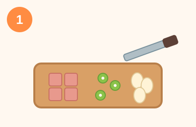
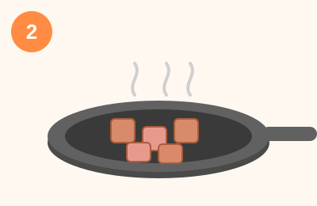
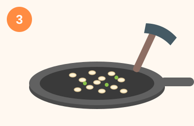

# 스팸 계란 볶음밥 (15분)

간단한 재료로 빠르게 만들 수 있는 볶음밥이에요.

## 재료 (1인분)
- 밥 1공기 (찬밥이면 더 좋아요)
- 스팸 1/4캔 (깍둑썰기)
- 계란 1개
- 대파 1/4대 (송송 썰기)
- 다진 마늘 1/2큰술
- 간장 1큰술
- 참기름 1큰술
- 소금, 후추 약간
- 식용유

## 만드는 법

1. **재료 손질 (3분)** — 스팸은 사방 1cm로 깍둑썰고, 대파는 송송 썰어둡니다.

   

2. **스팸 굽기 (3분)** — 팬에 식용유를 두르고 스팸을 넣어 겉면이 노릇해질 때까지 중불에서 볶아줍니다.

   

3. **밥 볶기 (5분)** — 다진 마늘과 대파를 넣고 향이 올라오면 밥을 넣습니다. 간장을 넣고 밥알이 흩어지도록 강불에서 잘 볶아줍니다. 소금, 후추로 간을 맞춥니다.

   

4. **계란 올리기 (3분)** — 볶음밥을 한쪽으로 밀어두고 빈 공간에 계란을 톡 깨서 프라이를 만들거나, 스크램블로 만들어 밥과 섞어줍니다.

   

5. **마무리 (1분)** — 불을 끄고 참기름을 둘러 향을 더한 뒤 그릇에 담아냅니다.

   

## 팁
- 찬밥을 쓰면 밥알이 잘 볶아져서 더 고슬고슬해요.
- 김가루나 통깨를 뿌리면 풍미가 더 좋아집니다.
