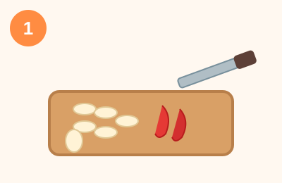
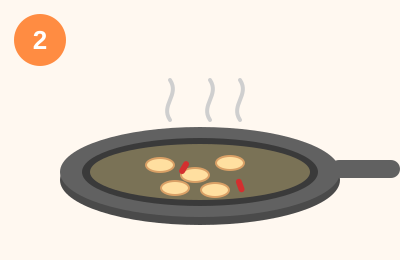
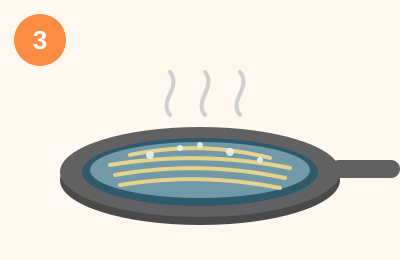
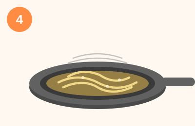

# 원팬 알리오 올리오 파스타 (15분)

하나의 팬에서 마늘 볶기부터 면 삶기까지 한 번에 끝내는 초간단 파스타예요. 냄비 하나가 줄어드니 설거지 부담도 확 줄어듭니다!

## 재료 (2인분)
- 스파게티 200g (반으로 부러뜨려도 OK)
- 마늘 5~6쪽 (얇게 슬라이스)
- 페페론치노(건고추) 2개 (또는 고춧가루 약간)
- 올리브오일 4큰술
- 물 500ml (또는 육수)
- 소금 1작은술, 후추 약간
- 파슬리 다진 것 (선택)
- 파마산 치즈 (선택)

## 만드는 법

1. **재료 손질 (2분)** — 마늘은 얇게 편으로 썰고, 페페론치노는 잘게 부숩니다.

   

2. **마늘 볶기 (2분)** — 깊은 팬에 올리브오일을 두르고 약불에서 마늘과 페페론치노를 노릇하게 볶아 향을 냅니다.

   

3. **면과 물 넣고 삶기 (9분)** — 팬에 물과 소금을 넣고 스파게티를 그대로 넣습니다. 센 불로 끓인 뒤 중불로 줄여 면이 잠기도록 가끔 저어가며 봉지 표기 시간만큼 삶습니다.

   

4. **졸이며 유화 (1~2분)** — 면이 익고 물이 자작해지면 강불에서 빠르게 저어 국물을 걸쭉하게 졸입니다. 필요하면 물을 조금씩 추가하세요.

   

5. **마무리 (1분)** — 불을 끄고 후추, 파슬리, 파마산 치즈를 올려 완성합니다.

   

## 팁
- 면수를 따로 만들 필요 없이 팬 안에서 전분물이 우러나 자연스럽게 소스가 걸쭉해져요.
- 마늘은 절대 태우지 말 것 — 쓴맛이 남아요.
- 물이 부족하면 소스가 뻑뻑해지니 중간중간 상태를 보며 물을 조금씩 추가하세요.
