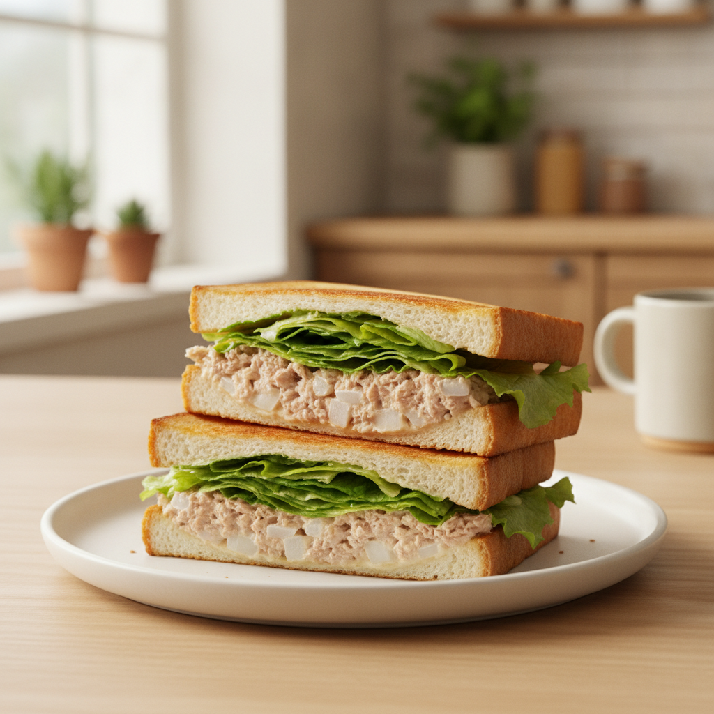

# 참치마요 샌드위치 (10분)

참치 통조림과 마요네즈, 양파만 있으면 뚝딱 완성되는 든든한 샌드위치예요. 도시락이나 간단한 한 끼로 딱이에요!

## 재료 (2인분)
- 식빵 4장
- 참치 통조림 1캔 (150g)
- 마요네즈 3~4큰술
- 양파 1/4개 (다진 것)
- 소금 약간, 후추 약간
- 설탕 약간 (선택, 양파 매운맛 중화)
- 양상추 또는 슬라이스 치즈 (선택)

## 만드는 법

1. **재료 손질 (2분)** — 참치는 체에 밭쳐 기름을 꼼꼼히 빼고, 양파는 잘게 다져 찬물에 5분 담가 매운맛을 뺀 뒤 물기를 꼭 짭니다.

2. **참치 마요 소스 만들기 (3분)** — 볼에 기름 뺀 참치, 다진 양파, 마요네즈, 소금, 후추(설탕 약간)를 넣고 골고루 섞습니다.

3. **빵 준비 (1분)** — 식빵은 취향에 따라 살짝 구워 바삭하게 만들고, 한쪽 면에 마요네즈를 얇게 발라줍니다.

4. **속재료 채우기 & 조립 (2분)** — 빵 한 장에 양상추를 깔고 참치 마요 소스를 두툼하게 펴 바른 뒤, 다른 빵으로 덮어 살짝 눌러줍니다.

5. **마무리 (2분)** — 랩으로 감싸 5분간 재운 뒤, 대각선으로 반 잘라 접시에 담아 완성합니다.

## 팁
- 참치 기름을 충분히 빼야 빵이 눅눅해지지 않아요.
- 양파는 찬물에 담가두면 매운맛이 빠지고 아삭한 식감이 살아나요.
- 랩으로 감싸 살짝 재우면 빵과 속재료가 자리를 잡아 자를 때 덜 부서져요.
