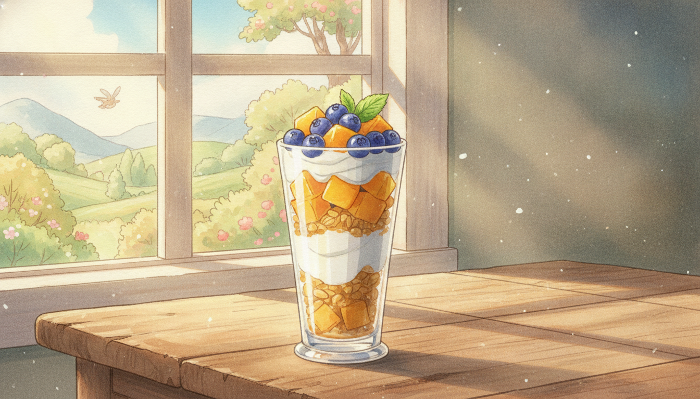

# 망고 요거트 파르페 (15분)

불 없이 15분 만에 완성하는 상큼하고 건강한 디저트예요.

## 재료 (1인분)
- 플레인 요거트 200g
- 냉동 또는 생 망고 1/2개 (깍둑썰기)
- 그래놀라 4큰술
- 꿀 1큰술
- 블루베리 또는 딸기 약간 (선택)
- 민트잎 약간 (선택)

## 만드는 법

1. **재료 준비 (3분)** — 망고는 껍질을 벗겨 사방 1cm로 깍둑썰고, 냉동 망고라면 실온에서 살짝 해동해둡니다.

2. **요거트 섞기 (2분)** — 볼에 플레인 요거트와 꿀 1/2큰술을 넣고 살살 섞어 단맛을 더합니다.

3. **첫 번째 층 쌓기 (3분)** — 유리컵 바닥에 그래놀라를 2큰술 깔고 그 위에 요거트를 1/2 분량 올립니다.

4. **두 번째 층 쌓기 (4분)** — 망고를 절반 올린 뒤 남은 요거트, 남은 그래놀라, 남은 망고 순으로 층을 쌓아줍니다.

5. **마무리 (3분)** — 꿀을 살짝 두르고 블루베리와 민트잎으로 장식해 완성합니다.

## 팁
- 그래놀라는 먹기 직전에 넣어야 바삭한 식감이 살아있어요.
- 망고 대신 바나나, 키위 등 좋아하는 과일로 대체해도 좋아요.
- 그릭요거트를 쓰면 더 꾸덕하고 든든한 맛이 됩니다.
