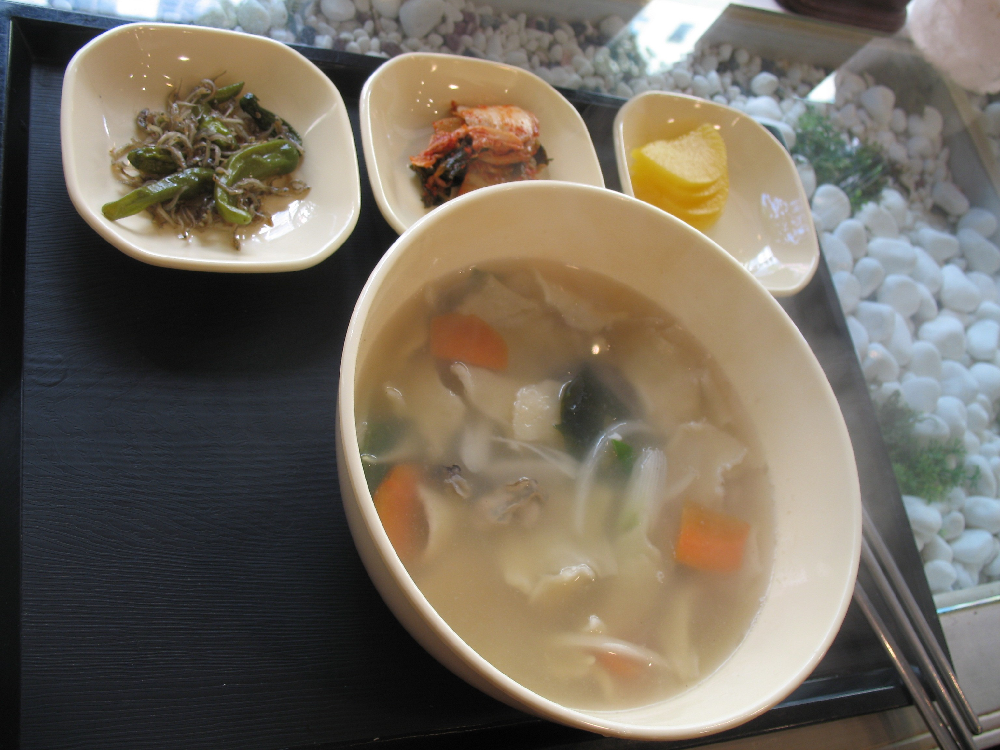

# 수제비 (15분)

멸치육수에 쫄깃한 밀가루 반죽을 뜯어 넣고 끓인, 속이 편안해지는 한 그릇 요리예요.

## 재료 (1인분)
- 중력분(밀가루) 1컵
- 물 1/2컵 (반죽용)
- 소금 약간 (반죽용)
- 참기름 약간 (반죽용)
- 멸치다시마 육수 2컵
- 애호박 1/4개 (반달썰기)
- 감자 1/2개 (나박썰기)
- 양파 1/4개 (채썰기)
- 대파 1/4대 (송송 썰기)
- 다진 마늘 1/2큰술
- 국간장 1큰술
- 소금, 후추 약간

## 만드는 법

1. **반죽 만들기 (3분)** — 밀가루에 물과 소금을 넣고 치대 매끈한 반죽을 만든 뒤 참기름을 살짝 발라 랩을 씌워 둡니다.

2. **육수 끓이기 (5분)** — 멸치다시마 육수를 냄비에 붓고 끓으면 감자와 다진 마늘을 넣어 끓이는 동안 반죽을 잠시 휴지시킵니다.

3. **채소 넣기 (2분)** — 감자가 살짝 익으면 애호박과 양파를 넣고 국간장으로 간을 맞추며 계속 끓입니다.

4. **반죽 뜯어넣기 (3분)** — 반죽을 얇게 펴서 한 입 크기로 뜯어 끓는 육수에 하나씩 넣고 서로 붙지 않도록 저어가며 익힙니다.

5. **마무리 (2분)** — 수제비가 떠오르면 대파를 넣고 소금과 후추로 간을 맞춘 뒤 그릇에 담아 완성합니다.

## 팁
- 반죽을 얇게 뜯을수록 더 빨리 익고 부드러운 식감이 됩니다.
- 시간이 있다면 반죽을 20~30분 냉장 휴지시키면 훨씬 쫄깃해져요.
- 얼큰하게 즐기고 싶다면 마지막에 청양고추를 송송 썰어 넣어보세요.
